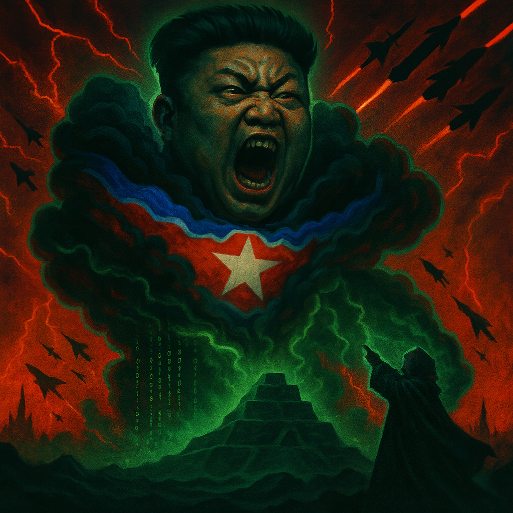

# 🇰🇵 North Korean Cloud Nightmare




**Advanced Persistent Threat Simulation Platform**

A comprehensive simulation of North Korean APT-style attack scenarios for security demonstrations, training, and sales engineering purposes.

This project was created to demonstrate Palo Alto Networks' cybersecurity detection and response capabilities, particularly in relation to their performance in Forrester Wave evaluations. Palo Alto Networks has been recognized as a Leader in [The Forrester Wave™: Extended Detection and Response (XDR) Platforms, Q2 2024](https://www.paloaltonetworks.com/blog/2024/06/forrester-names-palo-alto-networks-a-leader-in-xdr/) and [The Forrester Wave™: Security Analytics Platforms, Q2 2025](https://www.forrester.com/blogs/announcing-the-forrester-wave-security-analytics-platforms-2025-the-siem-vs-xdr-fight-intensifies/), showcasing their advanced threat detection and response capabilities that this simulation platform helps demonstrate.

## 🚀 Run Locally (Free)

If you don’t want to use GitHub Codespaces (which consumes billing),  
you can run this repo locally with **VS Code Dev Containers**:

1. Install:
   - [Docker Desktop](https://www.docker.com/products/docker-desktop)
   - [VS Code](https://code.visualstudio.com/)
   - [Dev Containers extension](https://marketplace.visualstudio.com/items?itemName=ms-vscode-remote.remote-containers)

2. Clone the repo:
   ```bash
   git clone https://github.com/Jonathan-D-a-v-i-d/North_Korean_Cloud_Nightmare.git
   cd North_Korean_Cloud_Nightmare
   code .
   ```

3. When prompted, click **"Reopen in Container"** to build the dev environment.

## ⚡ Quick Start for Sales Engineers

1. **Set up credentials** (one-time setup):
   ```bash
   source setup-env.sh
   ```
   This interactive script is built on top of `aws configure` and `pulumi login`.
   You can also run those commands individually if preferred.

   After credential setup, verify everything works:
   ```bash
   python North_Korean_Cloud_Nightmare.py setup
   ```

3. **Run a full demo**:
   ```bash
   python North_Korean_Cloud_Nightmare.py execute_full_scenario
   ```

4. **Clean up when done**:
   ```bash
   python North_Korean_Cloud_Nightmare.py clean_up
   ```

## 🎯 Usage Instructions

The North Korean Cloud Nightmare platform provides four main commands for sales engineers to demonstrate advanced persistent threat scenarios:

### Command Overview

```bash
python North_Korean_Cloud_Nightmare.py <command>
```

Available commands:
- `setup` - Check and validate environment configuration (run this first!)
- `deploy_infrastructure` - Deploy AWS infrastructure only
- `show_deployed_resources` - Display current infrastructure resources in JSON format
- `launch_attack` - Execute attack simulation (requires infrastructure)
- `execute_full_scenario` - Deploy infrastructure and launch attack in sequence
- `clean_up` - Remove all deployed infrastructure and artifacts

### 0. Setup Environment (Run This First!)

Before running any scenarios, validate your environment:

```bash
python North_Korean_Cloud_Nightmare.py setup
```

This command will:
- ✅ Check AWS credentials and connectivity
- ✅ Verify Pulumi login status
- ✅ Create and configure Pulumi stack
- ✅ Install required Pulumi plugins automatically
- ✅ Provide clear instructions if any setup is needed

**If setup fails**, the command will give you specific instructions to fix the issues.

### 1. Deploy Infrastructure Only

For demonstrations where you want to show the infrastructure first:

```bash
python North_Korean_Cloud_Nightmare.py deploy_infrastructure
```

After deployment, view the created resources:

```bash
python North_Korean_Cloud_Nightmare.py show_deployed_resources
```

This command:
- ✅ Deploys AWS infrastructure (IAM users, S3 buckets, DynamoDB tables, etc.)
- ✅ Validates deployment success
- ✅ Populates sample data
- ⏱️ **Duration**: ~5-10 minutes

### 2. Launch Attack Simulation

For executing just the attack portion (requires infrastructure to be deployed):

```bash
python North_Korean_Cloud_Nightmare.py launch_attack
```

This command:
- 🔐 Sets up MFA for DevOps user
- 🔍 Enumerates AWS resources
- 👤 Creates malicious user with elevated permissions
- 🛡️ Disables security controls (GuardDuty, CloudTrail)
- 💾 Exfiltrates and destroys S3 data
- 🗃️ Exfiltrates and destroys DynamoDB data
- 💀 Places ransomware notes
- ⏱️ **Duration**: ~15-20 minutes

### 3. Execute Full Scenario

For complete end-to-end demonstrations:

```bash
python North_Korean_Cloud_Nightmare.py execute_full_scenario
```

This command:
- 🚀 Deploys infrastructure
- ⚔️ Launches complete attack simulation
- ⏱️ **Duration**: ~20-30 minutes

### 4. Clean Up

To remove all infrastructure and artifacts after demonstrations:

```bash
python North_Korean_Cloud_Nightmare.py clean_up
```

This command:
- 🧹 Removes all AWS resources
- 🗑️ Deletes local artifacts
- 💰 Prevents ongoing AWS charges
- ⏱️ **Duration**: ~5-10 minutes

## 📊 Demo Artifacts

After running attacks, check these directories for demonstration artifacts:

- `./AWS_Enumeration/` - AWS resource enumeration results
- `./Infra/s3_Exfiltration/` - Exfiltrated S3 data
- `./Infra/DynamoDB_Exfiltration/` - Exfiltrated DynamoDB data

## 🎪 Sales Engineer Tips

### For Customer Demos:

1. **Start with `deploy_infrastructure`** to show the target environment
2. **Use `launch_attack`** to demonstrate the attack in real-time
3. **Always finish with `clean_up`** to remove resources

### For Proof of Concepts:

1. **Use `execute_full_scenario`** for complete automated demonstrations
2. **Monitor AWS CloudWatch** for real-time attack detection
3. **Show GuardDuty findings** after infrastructure deployment

### For Training Sessions:

1. **Run each command separately** to explain each phase
2. **Examine artifacts** between phases to show attack progression
3. **Use `--verbose` flag** for detailed output during training

## ⚠️ Important Notes

- 🔒 This is for **authorized security demonstrations only**
- 💰 Always run `clean_up` to avoid ongoing AWS charges
- 🎯 Designed for **sandbox/demo AWS accounts only**
- 📋 Requires appropriate AWS permissions for IAM, S3, DynamoDB, etc.

## 🆘 Troubleshooting

### Common Issues:

**Environment setup issues:**
```bash
# Run setup first to diagnose issues
python North_Korean_Cloud_Nightmare.py setup
```

**"Infrastructure not found" error:**
```bash
# Check if infrastructure exists
python North_Korean_Cloud_Nightmare.py show_deployed_resources

# If no resources found, deploy infrastructure first
python North_Korean_Cloud_Nightmare.py deploy_infrastructure
```

**AWS permission errors:**
- Run `aws sts get-caller-identity` to verify credentials
- Ensure your AWS user has admin permissions
- Check that your AWS account has sufficient limits

**Pulumi errors:**
- Run the setup command for guided troubleshooting
- For manual setup: ensure you're in the Infra directory when running `pulumi login`
- Alternative: Set `PULUMI_ACCESS_TOKEN` environment variable

For additional support, check the `/docs` directory or contact your platform administrator.
